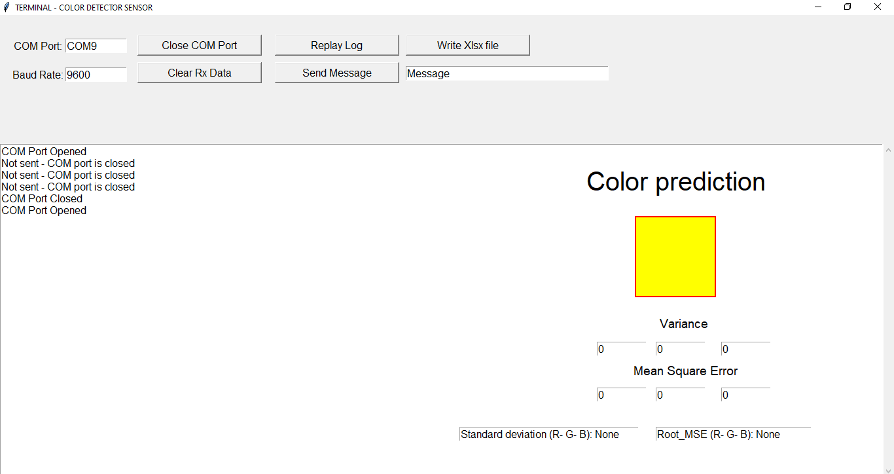

# color_detector
use color detector sensor TCS3200
connect sensor -> arduino and arduino -> computer

Color_detector folder has arduino code so that arduino can read RGB value from sensor and send data to serial port of computer

run terminal.py to read data from serial port

Run plotgraph.py to see graph of RGB value real time
